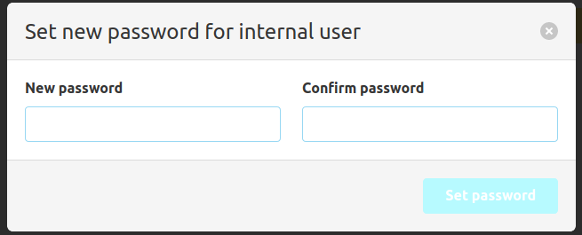
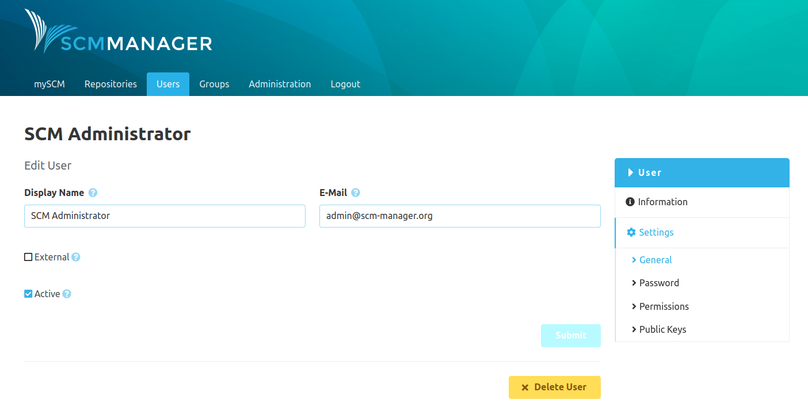
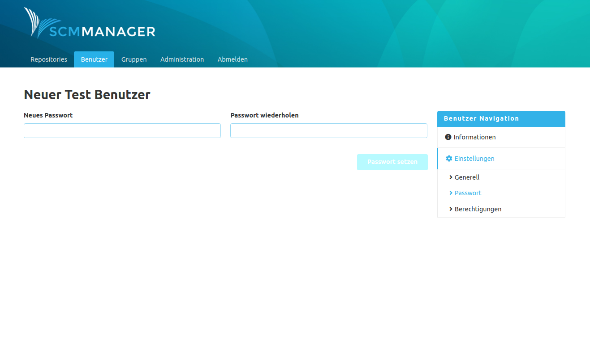
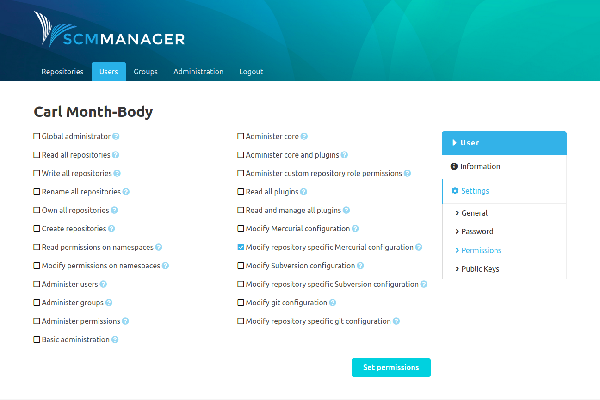
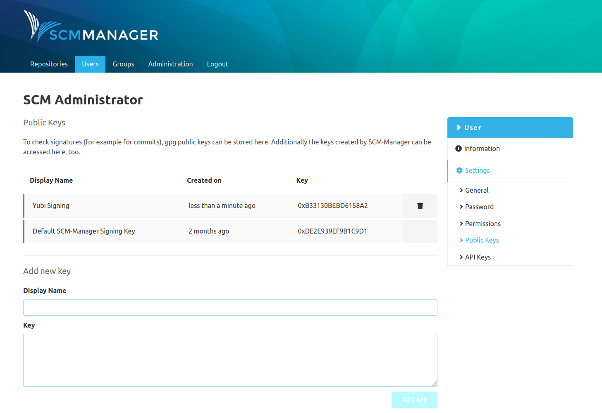
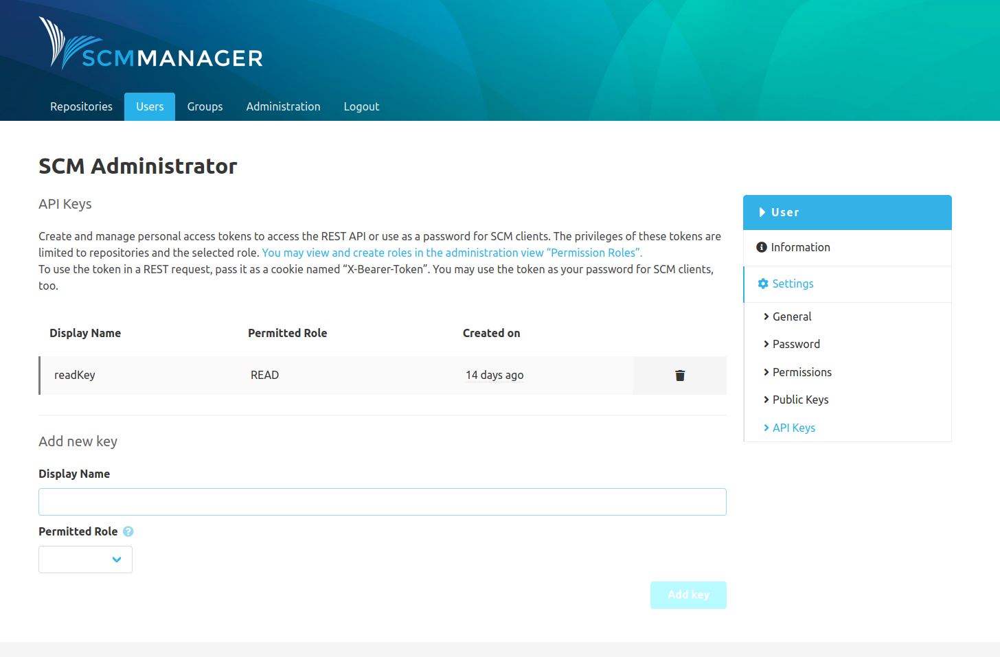

### General
In the general settings the display name, e-mail address, external flag and active status of an account can be edited. 

If a user is converted from internal to external the password is going to be removed. When switching an external user to an internal one, a password must be set using the password modal dialogue.

On the bottom is also a button to delete the user. The deletion is irreversible.

### Password
The password of a user can be changed in the password section. Users can also change their password themselves by clicking on the "Change password" link in the footer of SCM-Manager, under their username. That will take them to their settings where they can change their password, amongst others.

### Permissions
In the permissions section, the global, therefore not repository-specific permissions, can be configured for the user.
There is a tooltip for each permission that provide some more details about the option.

### Public keys
Add public keys to users to enable changeset signature verification.

### API Keys
To access SCM-Manager from other systems like for example CI servers, API keys can be created. They can be used to call
the REST API and for the access with SCM clients. Read more about API keys in the [Profile section](../../profile/#api-keys).

