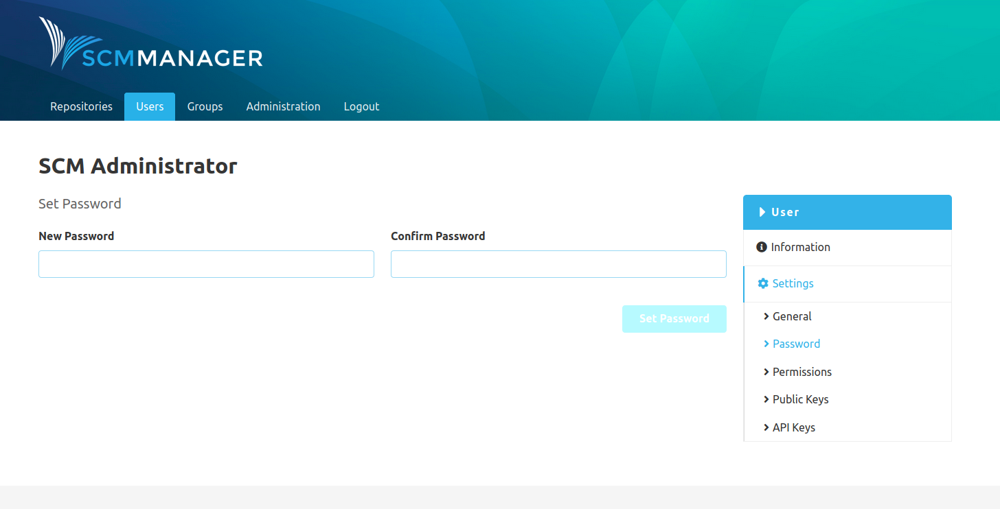

### General
In the general settings the display name, e-mail address and active status of an account can be edited. 

On the bottom is also a button to delete the user. The deletion is irreversible.

### Password
The password of a user can be changed in the password section. Users can also change their password themselves by clicking on the "Change password" link in the footer of SCM-Manager, under their username. That will take them to their settings where they can change their password, amongst others.

### Permissions
In the permissions section, the global, therefore not repository-specific permissions, can be configured for the user.
There is a tooltip for each permission that provide some more details about the option.

### Public keys
Add public keys to users to enable changeset signature verification.

