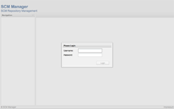
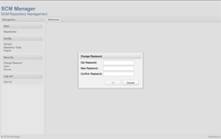
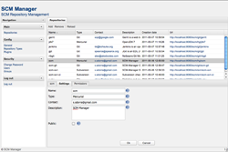
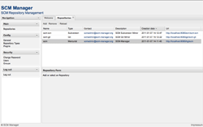
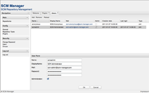
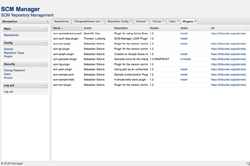
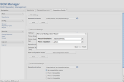

# Screenshots

<http://www.scm-manager.org/screenshots/>

## Screenshots pre 1.12

[\
*Login*](screenshots/login.png "Login")

[\
*Change Password*](screenshots/change-password.png "Change Password")

[\
*Repository Configuration*](screenshots/repository-config.png "Repository Configuration")

[\
*Repository Details*](screenshots/repository-details.png "Repository Details")

[\
*Repository Overview*](screenshots/repository-overview.png "Repository Overview")

[\
*User Overview*](screenshots/user-overview.png "User Overview")

[\
*Plugin Overview*](screenshots/plugin-overview.png "Plugin Overview")

[\
*Mercurial Configuration Wizard*](screenshots/mercurial-wizard.thumb.png "Mercurial Configuration Wizard")

[\
*Changesetviewer (with Gravatar Plugin)*](screenshots/changesetviewer-gravatar-plugin.png "Changesetviewer (with Gravatar Plugin)")
